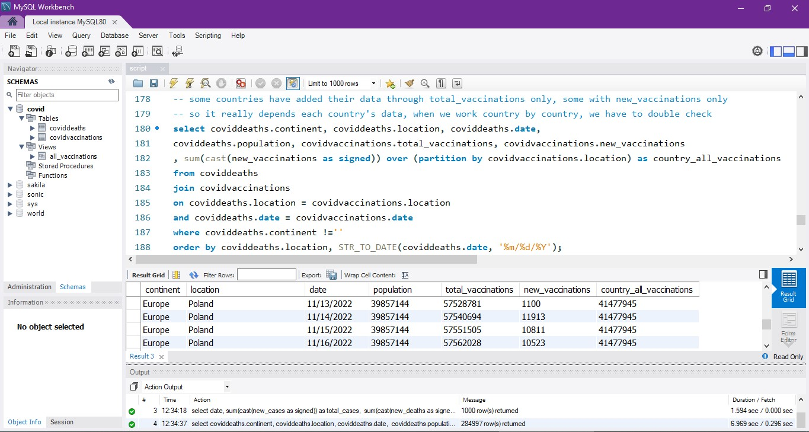
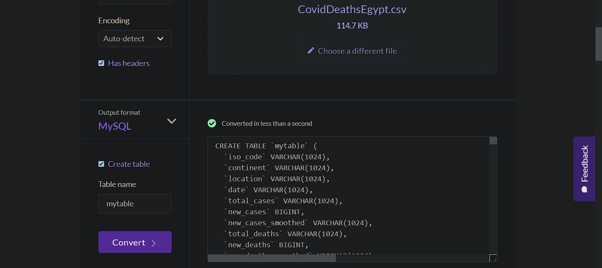
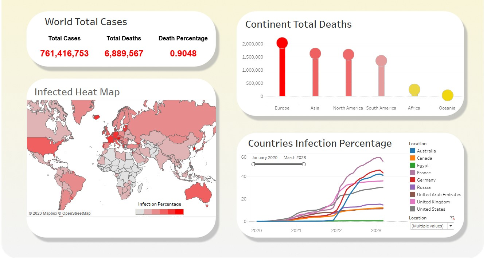

## Project demonstrated is inspired by Alex the analyst's guided project for SQL 

This data set was cleaned using MySQL workbench.

### A refined query:

This data has details of all COVID-19 deaths and vaccinations since the beginning of 2020. 
I downloaded the data, through this link:
[Our World Data](https://ourworldindata.org/covid-deaths)

### Questions
The following questions were explored in this analysis:
1. What is the trend of COVID-19 cases in a particular region or country over time?
2. What is the percentage of people who have recovered from COVID-19, and how does it compare to the number of people who have died from the virus?

### Loading the data into MySQL workbench:

The data was originally in CSV format, and was split into two files - one containing data and columns related to the number of deaths, and the other containing data related to vaccinations. The data was loaded into MySQL using the following steps:

The CSV files were uploaded to [Konbert.com](konbert.com)
, which generated a create table command followed by an insert command ready to be used in the MySQL Workbench query editor.

The output of konbert was used to create only the table structure. The LOAD DATA INFILE command was then used in the Workbench query editor to load the data from each row of the CSV files into their respective tables.

Here's an example of the LOAD DATA INFILE command used to load the data from the coviddeaths table:

LOAD DATA INFILE 'C:/ProgramData/MySQL/MySQL Server 8.0/Uploads/CovidDeaths.csv' 
INTO TABLE coviddeaths
FIELDS TERMINATED BY ',' 
ENCLOSED BY '"'
LINES TERMINATED BY '\n'
IGNORE 1 ROWS;

Please note that the CSV files must be present in a similar file path as specified in the LOAD DATA INFILE command, which is a security feature in Workbench's local data loading.

I inserted the query the website gave me, and there are now two main tables, coviddeaths, covidvaccinations. Both were loaded the same way.

### Working with the data:
Further analysis of the data can be done by querying the coviddeaths and covidvaccinations tables in MySQL. The SQL queries used in this analysis can be found in the script file.

### Most important insights:

One of the insights that intersted me was that the United States was the first country to start vaccinating it's citizens at 20/12/2020.

The peak of the virus was at 7/21/2021 with 20,005 deaths worldwide.

Highest deaths were in Europe exceeding 2 million deaths till this moment, followed by Asia and North America with about 1,700,000 deaths each.

The death percentage worldwide 0.9% almost being 1% with 6,889,567 deaths 

### Tableau Dashboard:

This Tableau dashboard showcases visualizations for four queries that were pulled from the "tableau_queries.sql" file. Each query has its own visualization that has been thoughtfully selected, including a heat map, a lollipop chart, and a line chart for each country.

The final dashboard has been designed to have a modern and appealing look, with all visualizations combined into one cohesive dashboard for easy viewing and analysis.

Features
Heat map: Displays data in a visually appealing heat map format, allowing for easy identification of trends and patterns.

Lollipop chart: Provides a unique and visually appealing way to showcase data, making it easy to compare different data points.

Line chart: Presents data trends over time using a line chart format, making it easy to identify patterns and changes.

Modern and appealing design: The dashboard has been carefully designed to provide an aesthetically pleasing and user-friendly experience.

Here's the [Tableau Public Link](https://public.tableau.com/app/profile/sameh.hasan/viz/Covid-19Analysis_16814255792100/ImprovedDashboard)

### Conclusion

And That's It!. I hope that you liked my project, and thank you so much for reading through till the end. If you need to ask me about anything related to the steps of creating this project or anything else :). Just feel free to contact me on my Email: Eng.Sameh.Abdelmoaty@Gmail.com

And I hope that you have a wonderful day.
